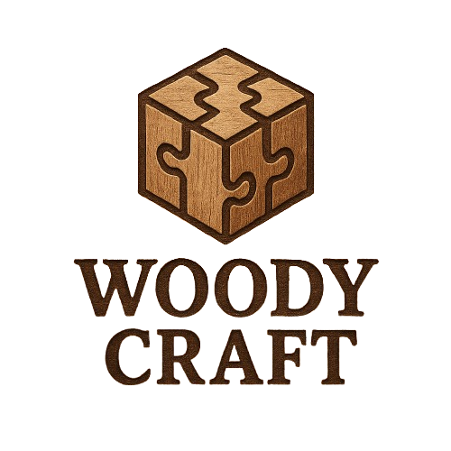

  

#  WoodyCraft

WoodyCraft est un **site web e-commerce** développé dans le cadre d’un projet de **2ème année de BTS SIO spécialité SLAM**.  
Ce projet a été réalisé par **Evan Etheve** et repose sur le framework **Laravel**.

---

##  À propos du projet

WoodyCraft est une boutique en ligne fictive permettant de mettre en pratique les compétences acquises en développement web :  
- Conception d’une architecture MVC avec **Laravel**  
- Mise en place d’un système d’authentification et de gestion des utilisateurs  
- Gestion des produits (CRUD, images, stock)  
- Intégration d’un panier et d’un module de commande  
- Design responsive et moderne pour l’expérience utilisateur  

---

##  Technologies utilisées

- **Laravel 10**  
- **HeidiSQL** (base de données relationnelle)  
- **TailwindCSS** / **Bootstrap** (front-end)  
- **Blade** (moteur de template Laravel)  
- **Composer** & **npm** pour la gestion des dépendances  

